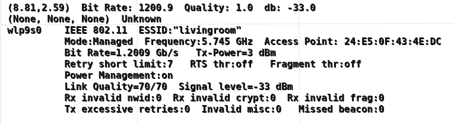
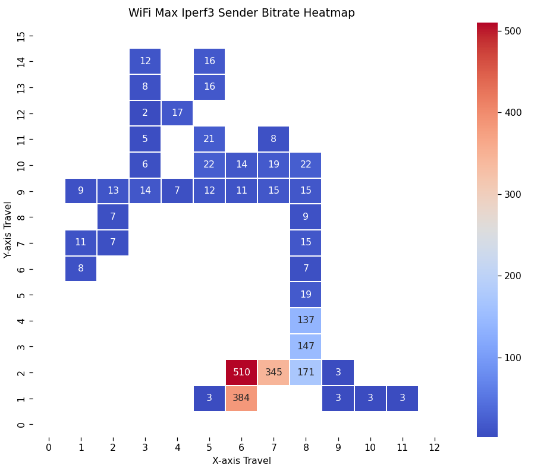
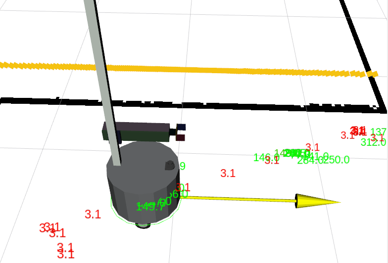

# WiFi Logger Visualizer for ROS 2

This package provides ROS 2 nodes for collecting, logging, and visualizing WiFi metrics (bit rate, link quality, signal strength, and iperf3 throughput). It integrates with odometry and GPS data to associate WiFi metrics with spatial coordinates and provides visualization in RViz2 and as standalone charts.

---

## Features

- **WiFi Data Collection**: Uses `iwconfig` and `iperf3` to collect WiFi metrics.
- **GPS and Odometry Integration**: Associates WiFi metrics with spatial context.
- **Data Logging**: Stores WiFi data in an SQLite database.
- **RViz2 Visualization**: Publishes overlay and marker messages for real-time visualization.
- **Standalone Charting**: Generates Matplotlib-based heatmaps.
- **Dynamic Parameters**: Supports runtime parameter updates.
- **Configurable**: All parameters are configurable via YAML and command line.

---

## Installation

### Prerequisites

- **ROS 2 Jazzy or later** ([Install Guide](https://docs.ros.org/en/jazzy/Installation.html))
- **Python 3** (should be installed with ROS 2)
- **SQLite3**:
  ```bash
  sudo apt install sqlite3 libsqlite3-dev
  ```
- **Python dependencies**:
  ```bash
  pip3 install numpy pyyaml matplotlib seaborn scipy
  ```
- **WiFi tools**:
  ```bash
  sudo apt install wireless-tools
  ```
- **rosdep** (for ROS dependencies):
  ```bash
  rosdep install --from-paths src --ignore-src -r -y
  ```

### Install and Build

```bash
mkdir -p ~/wifi_logger_visualizer_ws/src
cd ~/wifi_logger_visualizer_ws/src
git clone git@github.com:wimblerobotics/wifi_logger_visualizer.git
cd ~/wifi_logger_visualizer_ws
rosdep install --from-paths src --ignore-src -r -y
colcon build --symlink-install
source ~/wifi_logger_visualizer_ws/install/setup.bash
```

---

## Usage

### Logging WiFi Data

**NOTE:** You must run ROS 2 nodes that publish the **/odom** topic and the map to odom transform**. 
This is required in order to associate a location with the WiFi metrics gathered.
Optionally, if GPS location data is also being published on the **/gps/fix** topic, starting before this node is run,
the GPS location will also be associated with the WiFi metrics.

Run the logger node on your robot or where you want to gather WiFi metrics based on location:

```bash
ros2 launch wifi_logger_visualizer wifi_logger.launch.py
```

You may provide the following configuration parameters to the node:

- `db_path` (default: 'wifi_data.db')  
  Path to the SQLite database.
- `decimals_to_round_coordinates` (default: 3)  
  Number of decimal places to round x and y coordinates.
  Default: `3`. E.g., with a value of 3, a coordinate value of *123.456789* will be rounded to *123.457*.
- `do_iperf3` (default: True)  
  Whether to use **iperf3**, in client mode, to poll an **iperf3** server
  to get actual send and receive bit rates between the computer running the logger
  and the computer running the **iperf3** server.
- `do_publish_metrics` (default: True)  
  Whether to publish WiFi metrics on the **/wifi/metrics** topic.
  If True, a message of type **Float32MultiArray** will be published containing the
  following floating point values in this order:
  - bit_rate (from **iwconfig**)
  - link_quality (from **iwconfig**)
  - signal_level (from **iwconfig**)
  - sender_bitrate (from **iperf3**)
  - receiver_bitrate (from **iperf3**)
- `do_publish_overlay` (default: True)  
  If True, a message of type **OverlayText** will be published on the **/wifi_logger/overlay** topic.
  In that case, the following additional configuration parameters are available to
  format the overlay message:
  - `ov_horizontal_alignment` (default: 0)  
  Horizontal alignment of the overlay. Options: `0` (LEFT), `1` (RIGHT), `2` (CENTER).
  - `ov_vertical_alignment` (default: 3)  
  Vertical alignment of the overlay. Options: `3` (TOP), `2` (CENTER), `4` (BOTTOM).
  - `ov_horizontal_distance` (default: 10)  
  Horizontal distance of the overlay center from the border, in pixels.
  - `ov_vertical_distance` (default: 10)  
  Vertical distance of the overlay center from the border, in pixels.
  - `ov_width_factor` (default: 1.0)  
  Factor to adjust the overlay canvas width. Can be used to widen the overlay.
  - `ov_height_factor` (default: 1.0)  
  Factor to adjust the overlay canvas height. Can be used to lengthen the overlay.
  - `ov_font` (default: 'DejaVu Sans Mono')  
  Font used in the overlay.
  - `ov_font_size` (default: 4)  
  Font size in the overlay.
  - `ov_font_color` (default: '0.1 0.1 0.1 1.0')  
  Font color in RGBA format.
  - `ov_bg_color` (default: '1.0 1.0 1.0 0.5')  
  Background color in RGBA format.
  - `ov_do_short` (default: True)  
  Whether to display a short WiFi summary in the overlay.
  - `ov_do_full` (default: True)  
  Whether to display full WiFi information in the overlay.
- `iperf3_host` (default: '')  
  If you want **iperf3** monitoring to gather actual send and receive bitrates,
  rather than the theoretical bit rate provided by **iwconfig**,
  fill in the name of the computer running **iperf3** in server mode.
  The name can be an IP address, such as **192.168.1.123** or a **ZeroConf** (**Bonjour**)
  multicast protocol name, like **MyDesktopComputer.local**.
- `iperf3_interval` (default: 1.0)  
  How often to poll the **iperf3_host** (in seconds).
-  `max_signal_level` (default: -10.0)  
  Maximum signal level in dBm accepted from the **iwconfig** call.
  If the WiFi signal level is greater than this, a warning message will be sent to the log.
- `min_signal_level` (default: -100.0)  
  Minimum signal level in dBm accepted from the **iwconfig** call.
  If the WiFi signal level is less than this, a warning message will be sent to the log.
- `update_interval` (default: 1.0)  
  How often to log data (seconds).
- `wifi_interface` (default ''):  
  WiFi interface to monitor (leave empty for auto-detect).
  Otherwise, give the Wi-Fi device name, e.g., 'wlp8s0'.

These defaults are read from the **config/wifi_logger_config.yaml** file in the package.
Feel free to update this file with your preferred default values so you don't have to
override them in the launch file or on the command line.

#### Displaying the Text Overlay

You can see the **iwconfig** data with additional data in real-time as an overlay
in **rviz2**. First, you must have the **rviz-2d-overlay-plugins** package installed.
```bash
sudo apt install ros-jazzy-rviz-2d-overlay-plugins
```

While the logger is running, if **do_publish_overlay** is True,
in **rviz2** you can display the overlay by selecting the **/wifi_logger/overlay** topic
for display. It will look something like:


### Visualizing WiFi Data

You can visualize the logged data by running the **heatmap** node
on a machine that has visibility to the database created by the logger,
described above. 
You can view it as a standalone map or as a marker list in rviz2

#### As a Standalone Heatmap

```bash
ros2 launch wifi_logger_visualizer heat_mapper.launch.py standalone:=true
```

You may supply the following configuration parameters to the node:

- `aggregation_type` (default: max)  
  Which kind of value for the **heatmap_field** to display.
  Valid aggregation_types are:
  - average
  - max
  - min
- `costmap_topic` (default: '/global_costmap/costmap')  
  There must be a costmap being published that this node can subscribe to.
  That costmap will be used to provide the size, resolution, and origin
  of the costmap which is then used to position the text markers
  for visualization in **rviz2**.
- `db_path` (default: 'wifi_data.db')  
  Path to the SQLite database.
- `do_publish_markers` (default: True)  
  If true, a list of cube-shaped markers will be published to the **/wifi_heat_markers** topic. Each cube will be centered at the location where
  a reading took place and will be colorized to show how close to the minimum
  or maximum value the reading was at that location.
- `do_publish_text_markers` (default: True)  
  If true, a list of text markers will be published to the **/wifi_heat_text_markers** topic.
  Each text marker will be centered at the location where a reading took
  place, will show the value (for rate values it will be in mega bits
  per second), and will be colorized to show how close to the minimum
  or maximum value the reading was at that location.
- `heatmap_field` (default: 'iperf3_sender_bitrate')  
  Which field from the database to visualize. 
  Valid field names are:
  - bit_rate
  - iperf3_receiver_bitrate
  - iperf3_sender_bitrate
  - link_quality
  - signal_level
- `scale_factor` (default: 1.0)  
  For scaling the data values.
- `standalone` (default: True)
  If True, a **MathPlotLib** plot will be shown in its own window.
  If False, the rviz2 markers will be published.
- `text_size` (default 0.08)  
  The text size, in points, to be used for text generated in the
  **/wifi_heat_text_markers** topic.

An example of a standalone plot is:


An example of text markers showing in **rviz2** is:



---

## Troubleshooting

- **WiFi interface not detected**: Specify `wifi_interface` in the config or command line.
- **Overlay not visible in RViz2**: Ensure `rviz_2d_overlay_plugins` is installed and `/wifi/overlay` is subscribed.
- **Database errors**: Check `db_path` and permissions.
- **Parameter type errors**: Always specify float parameters as floats (e.g., `12.0` not `12`).
- **iperf3 is slow**: The node uses `-t 1 -O 0 -P 1` for fast, single-attempt tests. Ensure your iperf3 server is reachable and not overloaded.

---

## Related Resources

- [ROS 2 Documentation](https://docs.ros.org/en/rolling/)
- [rviz_2d_overlay_plugins](https://github.com/PickNikRobotics/rviz_2d_overlay_plugins)
- [SQLite3 Documentation](https://www.sqlite.org/docs.html)
- [Python sqlite3 module](https://docs.python.org/3/library/sqlite3.html)
- [Matplotlib](https://matplotlib.org/)
- [Seaborn](https://seaborn.pydata.org/)
- [iwconfig man page](https://linux.die.net/man/8/iwconfig)
- [iperf3 Documentation](https://iperf.fr/)
- [Bonjour/ZeroConf Documentation](https://help.ubuntu.com/community/Avahi)

---

## License

MIT License. See `LICENSE` for details.

---

## Acknowledgments

Special thanks to Sergei Grichine for contributions and feedback.  
[Sergei Grichine's GitHub](https://github.com/slgrobotics/robots_bringup)

---

If you have further questions or need more troubleshooting tips, please open an issue or consult the links above!
