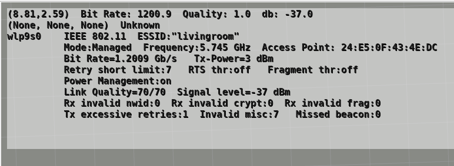
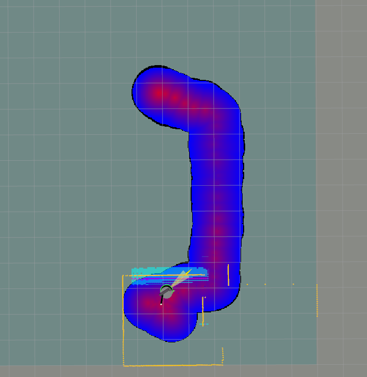
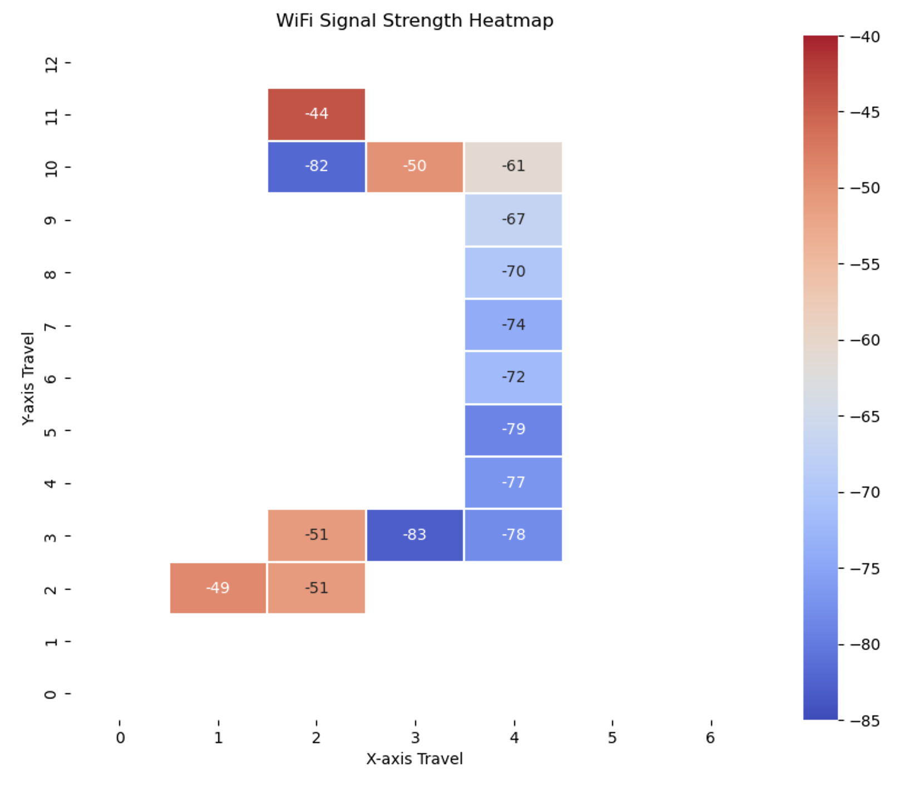
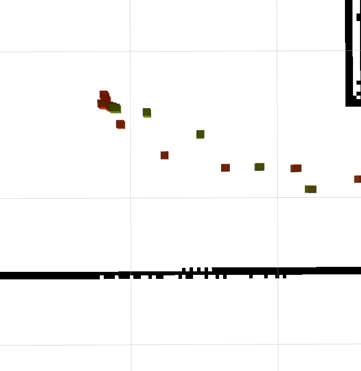
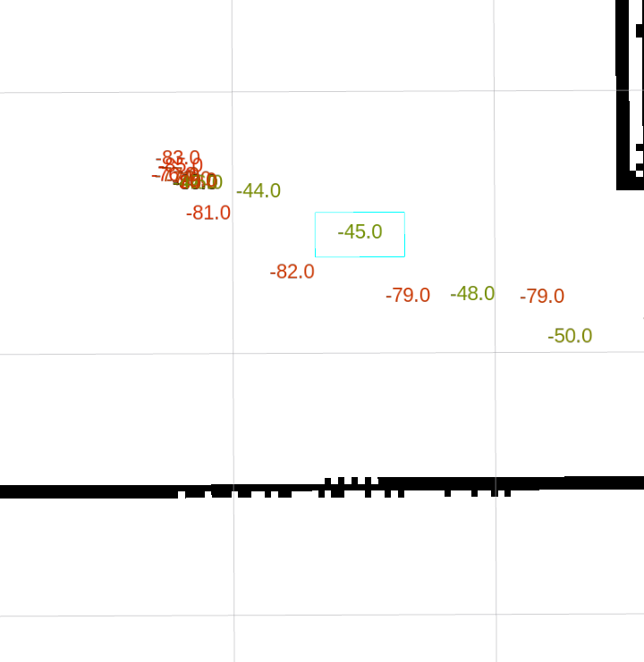

# WiFi Logger and Visualizer for ROS2

This package provides ROS2 nodes for collecting, logging, and visualizing WiFi metrics of bit rate, link quality, and signal strength. 
It integrates with odometry and, optionally, GPS data to associate WiFi metrics with spatial coordinates and provides visualization capabilities both in RViz2 and as a standalone chart.

**NOTE for user os previous versions of this package. The database schema has changed for
version 1.2 of this package. Please delete old databases in order to ensure compatability
this this version.**

---

## **Features**
- **WiFi Data Collection**: Uses `iwconfig` to collect WiFi metrics (bit rate, link quality, signal level).
- **GPS and Odometry Integration**: Associates WiFi metrics with GPS and odometry data for spatial context.
- **Data Logging**: Stores WiFi data in an SQLite database for later analysis.
- **RViz2 Visualization**: Publishes overlay messages for real-time visualization of WiFi metrics in RViz2.
- **Standalone Chart**: Generates a standalone chart for visualizing WiFi metrics.
- **Dynamic Parameter Updates**: Allows runtime updates to parameters such as update intervals and signal strength thresholds.
- **Configurable via YAML**: All parameters are configurable through a YAML file for ease of use as well as via the command line.

---

## **Installation**

### **Prerequisites**
1. **ROS2 (Jazzy or Later)**: Ensure ROS2 Jazzy or a later version is installed on your system. Follow the [official ROS2 installation guide](https://docs.ros.org/en/jazzy/Installation.html).

2. **SQLite3**: Ensure SQLite3 is installed on your system:
   ```bash
   sqlite3 --version
   ```

   If not installed, you can install it using the command.
```bash
   sudo apt install sqlite3 libsqlite3-dev
   ```

1. **Python Dependencies**: The package uses Python 3 and requires the following libraries:
   - `matplotlib`
   - `numpy`
   - `pyyaml`
   - `seaborn`
   - `scipi`
   - `sqlite3`
   
   Install missing Python dependencies using:
   ```bash
   pip3 install numpy pyyaml matplotlib seaborn scipy
   ```
2. **WiFi Tools**: Ensure `iwconfig` is installed on your robot:
   ```bash
   sudo apt install wireless-tools
   ```

---

### **Installation Steps**
1. Clone the repository into your ROS2 workspace both on your desktop (or whereever you want to do visualization) and on your robot, where you will do data logging of the WiFi metrics.
2. The following assumes you are use a directory in your home directory called **ros2_ws**. Change the following if you use a different workspace directory.
   ```bash
   cd ~/ros2_ws/src
   git clone <repository-url> wimble_wifi_logger_visualizer
   cd ..
   rosdep install --from-paths src --ignore-src -r -y 

   ```

3. Build the package:
   ```bash
   cd ~/ros2_ws
   colcon build --symlink-install
   ```

4. Source the workspace:
   ```bash
   source ~/ros2_ws/install/setup.bash
   ```

---

## **Usage**

### **Capturing Wifi Data**

To run the **wifi_logger_node.py** on your robot, you can use the provided launch file:
```bash
ros2 launch wifi_logger_visualizer wifi_logger.launch.py
```

The Wifi Logger node uses the **iwconfig** application to capture
the bit rate, link quality and signal strength from the onboard wifi device.
It requires odometry data to be published so that it can associate a location with
the captured wifi data.
If GPS location data is also being published, it will capture the GPS location as well.
The odometry data will normally come from the motor driver on your robot, and you will usually be running the Nav2 stack

The data is always written to the SQLite database. You can also specify that the data
should be published as one or two ROS topics as well.

#### **Configuration**
You can edit the **config.yaml** file, located in the **config/wifi_logger_config.yaml**
file before building this package to set the default parameters for this package.
You can also override the configuration parameters as needed on the command line.
This module specifically uses the following parameters:

* **db_path** (default: 'wifi_data.db')  
  The location of the SQLite datbase.
  If it does not exist, it will be created.
  If an abolute pathname is not provided, it will be used as a relative pathname.
* **decimals_round_coordinates** (default: 3)  
  Round all pose **x** and **y** values to this many places to the right of the decimal point.
  When entries are about to be put into the database, the database is checked to see if
  there is already any entry for the current odometry pose. If so, the current entry is
  replaced. Otherwise a new entry is created. As odometry can create poses with very
  small differences in locations, such as **x=0.1234567** vs **x=0.1234568**, this parameter allows you to put pose values into more useful buckets.
  A value of **3**, for instance, would round both of those **x** coordinates to a value
  of 0.123.
* **max_signal_level** (default: -20.0)  
  Maximum expected signal level in dBm. Values higher than this will be rejected.
* **min_signal_level** (default -100.0)  
  Minimum expected signal level in dBm. Values lower than this will be rejected.
* **publish_metrics** (default: true)  
  If **true**, publish the raw WiFi bit rate, link quality and signal level data as an array of three
  float values to the **/wifi/metrics** topic.
  ```bash
  ros2 topic echo /wifi/metrics 
  layout:
    dim: []
    data_offset: 0
  data:
  - 960.7000122070312
  - 1.0
  - -31.0
  ```
* **publish_overlay** (default: true)  
  If **true**, publish data to be visualized as a text overlay in RViz2 to the
  **/wifi/overlay** topic.
  ```bash
  ros2 topic echo /wifi/overlay 
  action: 0
  width: 1200
  height: 240
  horizontal_distance: 10
  vertical_distance: 10
  horizontal_alignment: 0
  vertical_alignment: 3
  bg_color:
    r: 0.0
    g: 0.0
    b: 0.0
    a: 0.05000000074505806
  line_width: 0
  text_size: 12.0
  font: DejaVu Sans Mono
  fg_color:
    r: 0.800000011920929
    g: 0.800000011920929
    b: 0.30000001192092896
    a: 0.800000011920929
  text: "<pre>(8.81,2.59)  Bit Rate: 1080.6  Quality: 1.0  db: -31.0\n(None, None, None)  Unknown  \nwlp9s0    IEEE 802.11  ESSID:\"livingro..."

  ```

The following parameters can be changed dynamically using, e.g., the **rqt** program:
* decimals_to_round_coordinates
* max_signal_level
* min_signal_level
* update_interval

#### **Additional Configuration for Publishing the Overlay Topic**
If the configuration parameter **publish_overlay** is true, there are
extra configuration parameters you can use to customize how the text
is presented in the overlay.
* **ov_horizontal_alignment** (default: 0)  
  0 => left, 1 => right, 2 => center.
* **ov_vertical_alignment** (default: 3)
  2 => center, 3 => top, 4 => bottom  
* **ov_horizontal_distance** (default: 10)  
  Pixel distance of overlay from left edge of RViz2 window.
* **ov_vertical_distance** (default: 10)  
  Pixel distance of overlay from top edge of RViz2 window
* **ov_width_factor** (default: 1.0)  
  Scaling factor for the width of the overlay.
* **ov_height_factor** (default: 1.0)  
  Scaling factor for the height of the overlay.
* **ov_font** (default: 'DejaVu Sans Mono')  
  Name of the system font to be used.
* **ov_font_size** (default: 12.0)  
  Size of the system font to be used.
* **ov_font_color** (default: '0.8 0.8 0.3 0.8')  
  Color of the system font to be used (red, gree, blue, alpha).
* **ov_bg_color** (default: "0.0 0.0 0.0 0.05")  
  Background olor of the for the overlay to be used (red, gree, blue, alpha).
* **ov_do_short** (default: True)  
  If **True**, begin the overlay with the text with the **x** and **y** values
  enclosed in parenthesis, followed by the bit rate, link quality and signal levels.
  On a second line, show the GPS lattitude, longitude and altitude in parenthesis, followed the GPS status.

* **ov_do_full** (default: True)  
  If **True**, add to the text overlay the raw text result from the **iwconfig** result.

An example of the overlay, with missing GPS data, is:

  

### **Displaying Wifi Data as a Topological Map**

To run the **wifi_visualizer_node.py**, you can use the provided launch file:
```bash
ros2 launch wifi_logger_visualizer wifi_visualizer.launch.py
```

The Wifi Visualizer node begins by listenening for an existing costmap
(by default it's the costmap published on the **/global_costmap/costmap** topic)
in order to create a new costmap of the same size, resolution and origin.
Then a connection is made to the database produced by the Wifi Logger node.
That database may be a saved one or it may contain live data.

This node will pick up the last time stamp recorded in the database, generate a
visualization of the data as a costmap, and will periodically look to see if
the database has changed (i.e., if the Wifi Logger node is making changes to
the database). If the database changes, the costmap will be updated.

#### **Configuration**
You can edit the **configuration.yaml** file, located in the **config/wifi_logger_config.yaml**
file before building this package to set the default parameters for this package.
You can also override the configuration parameters as needed on the command line.
This module specifically uses the following parameters:
* **costmap_topic** (default: '/global_costmap/costmap')  
  The costmap topic to subscribe to in order to get the size, resolution and
  origin to use for the costmaps to be published by this module.
* **db_check_frequency** (default: 2.0 Hz)  
  How often to check the database for changes.
* **db_path** (default: 'wifi_data.db')  
  The location of the SQLite datbase.
  If an abolute pathname is not provided, it will be used as a relative pathname.
* **enable_bit_rate** (default: True)  
  If true, publish a costmap showing the interpolated bit rate readings
  on the **/wifi_bit_rate_costmap** topic.
* **enable_link_quality** (default: True)  
  If true, publish a costmap showing the interpolated link quality readings
  on the **/wifi_link_quality_costmap** topic.
* **enable_signal_level** (default: True)  
  If true, publish a costmap showing the interpolated signal level readings
  on the **/wifi_signal_level_costmap** topic.
* **max_interpolation_distance** (default: 1.0 meters)  
  The costmap will attempt to produce a smooth gradient between actual readings
  in the database. Each reading in the database will be interpolated towards
  other readings in the database that are within this distance.
* **publication_frequency** (default: 1.0 Hz)  
  How often to update the published costmaps.

An example of the signal strength costmap displayed in RViz2 is:



### **Displaying Wifi Data as a Heat map**

To run the **heat_mapper_node.py**, you can use the provided launch file:
```bash
ros2 launch wifi_logger_visualizer heat_mapper.launch.py
```

The Wifi Heat Mapper node runs in one of two modes.
In **standalone** mode, it produces a **MatPlotLib** based chart showing a
two dimensional chart of the signal strength data.
When not in **standalone** mode, the node begins by listenening for an existing costmap
(by default it's the costmap published on the **/global_costmap/costmap** topic)
in order to create a new costmap of the same size, resolution and origin.
Then a connection is made to the database produced by the Wifi Logger node.
That database may be a saved one or it may contain live data.

This node will pick up the last time stamp recorded in the database, generate a
visualization of the data as a costmap, and will periodically look to see if
the database has changed (i.e., if the Wifi Logger node is making changes to
the database). If the database changes, the costmap will be updated.

#### **Configuration**
You can edit the **configuration.yaml** file, located in the **config/wifi_logger_config.yaml**
file before building this package to set the default parameters for this package.
You can also override the configuration parameters as needed on the command line.
This module specifically uses the following parameters:
* **costmap_topic** (default: '/global_costmap/costmap')  
  The costmap topic to subscribe to in order to get the size, resolution and
  origin to use for the costmaps to be published by this module.
  Only used if **standalone** is False.
* **db_check_frequency** (default: 2.0 Hz)  
  How often to check the database for changes.
  Only used if **standalone** is False.
* **db_path** (default: 'wifi_data.db')  
  The location of the SQLite datbase.
  If an abolute pathname is not provided, it will be used as a relative pathname.
* **do_publish_markers** (default: True)
  If True, publish a heat map list of RViz2 markers showing the signal level readings
  as cubes on the /wifi_heat_markers topic. 
  The size of each marker cube is twice the resolution size of the costmap
  so that they will be more visible.
  The markers will be colorized so that signal levels
  close to the mininum signal level will be read and signal levels near the
  maximum signal level will be green.
  The published costmap as the **map** frame as its frame id.
  Only used if **standalone** is False.
* **do_publish_text_markers** (default: True)
  If True, publish a heat map list of RViz2 markers showing the dBm signal level readings
  as text strings on the /wifi_heat_markers topic. 
  The markers will be colorized so that signal levels
  close to the mininum signal level will be read and signal levels near the
  maximum signal level will be green.
  The published costmap as the **map** frame as its frame id.
  The text size of each marker is that of the **text_size** parameter.
  Only used if **standalone** is False and **do_publish_markers** is True.
* **scale_factor** (default: 1.0)  
  When producing the **standalone** heat map, multiply all database values by this scale value.
* **standalone** (default: False)  
  If True, produce only a **MatPlotLib** window showing the heat map. 
  If False, produce a costmap for visualization in RViz2.
* **text_size** (default: 0.08)  
  The text size (in points) of the text generated for each text marker as
  described in the **do_publish_text_markers** parameter.

  An example of the **standalone** heat map is:
  

  An example of the RViz2 cubical markers (i.e. NOT **standalone**) displayed is:
  

  An example of the RViz2 text markers (i.e. NOT **standalone**) displayed is:
  

### **Database**
WiFi data is stored in an SQLite database. 
The schema is:
```bash
sqlite> .schema
CREATE TABLE wifi_data (
                    id INTEGER PRIMARY KEY AUTOINCREMENT,
                    timestamp TEXT NOT NULL,
                    x REAL,
                    y REAL,
                    latitude REAL,
                    longitude REAL,
                    gps_status INTEGER,
                    gps_service INTEGER,
                    bit_rate REAL,
                    link_quality REAL,
                    signal_level REAL
                );
CREATE TABLE sqlite_sequence(name,seq);
```
---

## **Modules**

### **1. `wifi_logger_visualizer/wifi_logger_node.py`**
The main ROS2 node that:
- Collects WiFi metrics using `iwconfig`.
- Associates WiFi data with GPS and odometry coordinates.
- Publishes metrics and overlay messages.
- Stores data in an SQLite database.

### **2. `database_manager.py`**
Handles all database operations, including:
- Creating the database schema.
- Inserting WiFi data.
- Cleaning up old records.

### **3. `wifi_data_fetcher.py`**
Fetches WiFi metrics using `iwconfig` and validates the data.

---

## **Visualization in RViz2**
To visualize WiFi metrics in RViz2:
1. Start RViz2:
   ```bash
   rviz2
   ```
2. Add the `OverlayText` display plugin.
3. Subscribe to the `/wifi/overlay` topic to see real-time WiFi metrics.

---

## **Dynamic Parameter Updates**
You can update parameters at runtime using the `ros2 param` command. For example:
```bash
ros2 param set /wifi_logger update_interval 2.0
```

---

## **Troubleshooting**

### **1. WiFi Interface Not Detected**
Ensure your WiFi interface is active and visible to `iwconfig`. You can manually specify the interface in the YAML configuration file.

### **2. RViz2 Overlay Not Displayed**
Ensure the `rviz_2d_overlay_plugins` package is installed and the `/wifi/overlay` topic is subscribed in RViz2.

### **3. Database Errors**
Check the database path in the YAML configuration file and ensure the directory is writable.

---

## **License**
This package is licensed under the MIT License. See the `LICENSE` file for details.

---

## **Contributing**
Contributions are welcome! Please submit issues or pull requests on the GitHub repository.

---

## **Acknowledgments**
Many thanks to **Sergei Grichine** for additions, improvements and feedback during
development of this package. Please visit this github link and give him a star.
[Sergei Grichine's GitHub](https://github.com/slgrobotics/robots_bringup)

This package uses:
- ROS2 Jazzy for robotics middleware.
- `rviz_2d_overlay_plugins` for visualization.
- `iwconfig` for WiFi data collection.