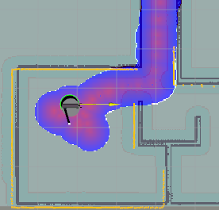

# WiFi Logger Visualizer

A ROS2 package for logging WiFi signal data and visualizing it as costmaps.

Here is an example of the costmaps generated by the visualizer node in rviz2:



## Overview

This package provides two main nodes:

1. **WiFi Logger Node**: Collects WiFi signal data (link quality, signal level, bit rate) at the robot's current position and stores it in a SQLite database.
2. **WiFi Visualizer Node**: Reads data from the database and publishes costmaps showing WiFi signal strength across the environment.

## Features

- Real-time WiFi signal data collection
- Automatic position tracking using odometry and transforms
- SQLite database storage for persistent data
- Three different costmap visualizations:
  - Link Quality (0-1)
  - Signal Level (-90 to -30 dBm)
  - Bit Rate (0-1000 Mb/s)
- Configurable interpolation distance
- Automatic database change detection
- Optimized for real-time performance

## Dependencies

- ROS2 (tested with Jazzy)
- Python 3.8+
- Matplotlib
- SQLite3
- NumPy
- Seaborn
- SciPy

## Installation

1. Clone this repository into your ROS2 workspace:
   ```bash
   cd ~/ros2_ws/src
   git clone https://github.com/yourusername/wifi_logger_visualizer.git
   ```

2. Install dependencies:
   ```bash
   pip3 install numpy scipy
   apt install sqlite3
   ```

3. Build the package:
   ```bash
   cd ~/ros2_ws
   colcon build --packages-select wifi_logger_visualizer
   ```

4. Source the workspace:
   ```bash
   source ~/ros2_ws/install/setup.bash
   ```

## Usage

### WiFi Logger Node

The logger node collects WiFi data at the robot's current position:

```bash
ros2 launch wifi_logger_visualizer wifi_logger.launch.py
```

Parameters:
- `db_path`: Path to the SQLite database file (default: `wifi_data.db` in current directory)
- `wifi_interface`: WiFi interface name (default: auto-detect)
- `update_interval`: How often to collect data in seconds (default: 1.0)
- `max_signal_strength`: Maximum expected signal strength in dBm (default: -30.0)
- `min_signal_strength`: Minimum expected signal strength in dBm (default: -90.0)

Signal strength is expected to be in the range of -90 dBm (weak) to -30 dBm (strong). The logger will only collect data within this range.

### WiFi Visualizer Node

The visualizer node creates costmaps from the collected data:

```bash
ros2 launch wifi_logger_visualizer wifi_visualizer.launch.py
```

Parameters:
- `db_path`: Path to the SQLite database file (default: `wifi_data.db` in current directory)
- `publish_frequency`: How often to publish costmaps in Hz (default: 1.0)
- `db_check_frequency`: How often to check for database updates in Hz (default: 2.0)
- `max_interpolation_distance`: Maximum distance for interpolation in meters (default: 5.0)
- `enable_link_quality`: Enable link quality costmap (default: true)
- `enable_signal_level`: Enable signal level costmap (default: true)
- `enable_bit_rate`: Enable bit rate costmap (default: true)
- `costmap_topic`: Topic to read costmap dimensions from (default: `/global_costmap/costmap`)

## Viewing the Costmaps

To view the costmaps in RViz2:

1. Launch RViz2:
   ```bash
   rviz2
   ```

2. Add an OccupancyGrid display
3. Set the topic to one of:
   - `/wifi_link_quality_costmap`
   - `/wifi_signal_level_costmap`
   - `/wifi_bit_rate_costmap`

## Database Schema

The SQLite database contains a table with the following columns:
- `timestamp`: When the data was collected
- `x`: X coordinate in meters
- `y`: Y coordinate in meters
- `bit_rate`: WiFi bit rate in Mb/s
- `link_quality`: Link quality (0-1)
- `signal_level`: Signal level in dBm

Only the most recent data point for each (x, y) coordinate is stored. The logger node will automatically create the database if it doesn't exist.
The visualizer node will automatically detect changes in the database and update the costmaps accordingly.

## Useful sqlite commands
- To view the database schema:
  ```bash
  sqlite3 wifi_data.db
  .schema
  ```
- To view the data:
  ```bash
  sqlite3 wifi_data.db
  .headers on
  SELECT * FROM wifi_data;
  ```

Sample output:
```bash
sqlite> select * from wifi_data limit 3;
id|timestamp|x|y|bit_rate|link_quality|signal_level
1|2025-04-01 19:03:58|8.81000000000088|2.59000000000011|1200.9|1.0|-39.0
2|2025-04-01 19:17:06|3.15298861662747e-13|2.10237650673698e-25|1200.9|1.0|-39.0
3|2025-04-01 19:17:07|3.15298837078504e-13|2.10237640138469e-25|1200.9|1.0|-35.0
```

## Troubleshooting

- If the logger node can't find your WiFi interface, specify it manually with the `wifi_interface` parameter
- If the visualizer node doesn't show data, check that the database path is correct
- If costmaps don't appear in RViz2, make sure the frame_id matches your map frame

## Code tested with:
- Ubuntu 24.04
- ROS2 Jazzy
- Python 3.8
- SQLite3
- NumPy
- SciPy
- RViz2
- ROS2 Navigation2
- ROS2 TF2
- ROS2 Odometry
- ROS2 Costmaps
- On Intel architecture
- On Raspberry Pi 4 and Pi 5

## Useful Links
- https://www.sqlite.org/quickstart.html
- https://github.com/sqlite/sqlite
- https://www.sqlite.org/

## License

This package is licensed under the MIT License.

## Contributing

Contributions are welcome! Please feel free to submit a Pull Request.
